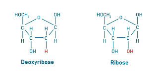
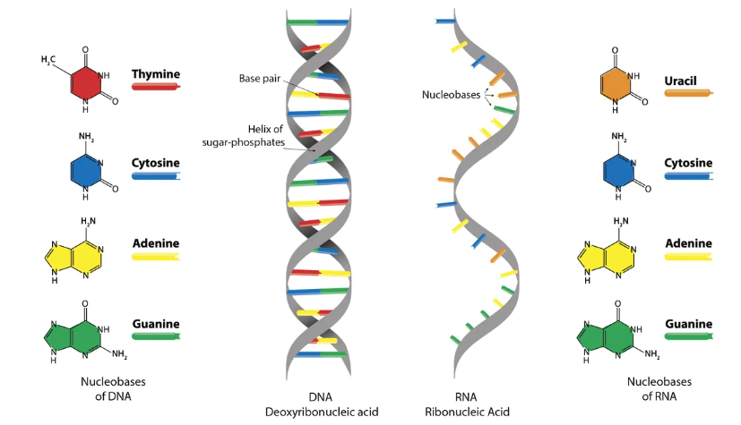

# DNA vs. RNA: Key Difference
> "DNA and RNA are both nucleic acids that play crucial roles in genetics, but they differ in several important ways."
## The Sugar Distinction
- The most fundamental difference lies in their sugar components.
- DNA has deoxyribose sugar (C5H10O4) while RNA has ribose sugar (C5H10O5).
- DNA is **chemically more stable** because it lacks the reactive oxygen atom at the 2' position of its sugar, making it less prone to hydrolysis and other degradation reactions.
- While RNA is **chemically less stable** because of the -OH group at the 2' position of its sugar, basically oxygen in the -OH group is electronegative, and can attack nearby atoms. It can attack the  phosphate group that basically connects one nucleotide to the next. As a result, the phosphodiester bond breaks, which holds the RNA backbone together. This whole reaction is called hydrolysis (breaking a bond using water).

  

  ## Base Distinction
  The **nitrogenous bases** are one of the key differences between DNA and RNA.  
Both molecules share **three bases**: **Adenine (A)**, **Guanine (G)**, and **Cytosine (C)**.  
However, they differ in the **fourth base**:

-  **DNA** contains **Thymine (T)**
-  **RNA** contains **Uracil (U)**

**Thymine** is essentially a methylated form of uracil.  
This slight chemical modification, the addition of a **methyl group (–CH₃)**, makes DNA more **chemically stable** and less prone to mutation.  
That’s why DNA serves as the long-term **genetic storage molecule**, while RNA is typically more **transient** and suited for **protein synthesis** and **gene regulation**.

---

| Molecule | Nitrogenous Bases | Key Difference | Stability |
|-----------|------------------|----------------|------------|
| **DNA**  | Adenine (A), Thymine (T), Guanine (G), Cytosine (C) | Thymine (T) replaces Uracil |  More Stable |
| **RNA**  | Adenine (A), Uracil (U), Guanine (G), Cytosine (C) | Uracil (U) replaces Thymine |  Less Stable |

  

  
   
  <em>Figure 1: Comparison of nitrogenous bases in DNA and RNA.  
 (Source: <a href="https://www.technologynetworks.com/genomics/articles/what-are-the-key-differences-between-dna-and-rna-296719" target="_blank">Technology Networks</a>)</em></em>

## 🧬 Structural Distinction

Structurally, **DNA** and **RNA** differ in how their strands are arranged and function.  
**DNA** typically exists as a **double-stranded molecule** forming the famous **double helix**, though some **viral DNA** can be single-stranded.  
In contrast, **RNA** is usually **single-stranded**, but it can fold back on itself to create **complex three-dimensional structures** with localized double-stranded regions.  

This structural difference is linked to their **distinct biological roles**:  
- DNA’s **double-stranded structure** provides **stability** for long-term genetic information storage.  
- Complementary base pairing acts as a **backup mechanism** for error correction during replication.  
- RNA’s **single-stranded nature** gives it **versatility**, allowing it to perform diverse functions such as **protein synthesis**, **gene regulation**, and **enzymatic activity** (in ribozymes).

---

### 🧠 Comparison of Structural Properties

| Feature | **DNA** | **RNA** |
|----------|----------|----------|
| **Structure Type** | Double-stranded (Double Helix) | Single-stranded (can fold into 3D shapes) |
| **Stability** | Highly stable | Less stable, easily degraded |
| **Complementary Base Pairing** | Yes – provides error checking and backup | Limited, only in folded regions |
| **Main Function** | Long-term genetic storage | Multiple roles – messenger, ribosomal, transfer, regulatory |
| **Example of Exception** | Some viral DNA is single-stranded | Some viral RNA can be double-stranded |

---

## 🧬 Functional and Locational Distinction

Within the cell, **DNA** and **RNA** occupy different locations and serve distinct purposes.  
**DNA** is mainly found in the **nucleus** of eukaryotic cells, with small amounts also present in **mitochondria** and **chloroplasts**.  
**RNA**, on the other hand, is **synthesized in the nucleus** but then travels to the **cytoplasm**, where most of its functions occur.

Functionally, their roles are equally distinct:  
- **DNA** acts as the **permanent repository** of genetic information — stable and protected within the nucleus.  
- **RNA** plays **multiple active roles**, including carrying genetic messages, building proteins, regulating genes, and even catalyzing biochemical reactions.

---

### 🧠 Comparison of Location and Function

| Feature | **DNA** | **RNA** |
|----------|----------|----------|
| **Primary Location** | Nucleus (also in mitochondria & chloroplasts) | Synthesized in nucleus; functions in cytoplasm |
| **Main Function** | Long-term storage of genetic information | Multiple roles: mRNA (messenger), rRNA (ribosomal), tRNA (transfer), regulatory & catalytic RNAs |
| **Stability** | Highly stable | Less stable, short-lived |
| **Mobility** | Remains mostly in nucleus | Moves between nucleus and cytoplasm |
| **Associated Processes** | Replication, Transcription | Transcription, Translation, Gene Regulation |

---

 
