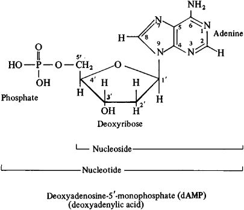

##  DNA Chemical Composition  

###  Nucleotides: The Building Blocks  

The fundamental unit of DNA is the **nucleotide**, the essential building block that defines the molecule’s structure and function.  
Each nucleotide is made up of **three components** that are **chemically bonded** together:  

1. **A five-carbon sugar**  called **deoxyribose**  
2. **A phosphate group**  linking the sugar molecules to form the backbone  
3. **A nitrogenous base**  storing genetic information (A, T, G, C)  

The sugar molecule, **deoxyribose**, contains **five carbon atoms**, numbered **1′ to 5′** according to biochemical convention.  
The prefix **“deoxy”** signifies the **absence of one oxygen atom** at the **2′ carbon**, which makes it chemically distinct from **ribose** in RNA.  
This small structural difference is crucial; it gives DNA greater **stability** and makes it less reactive than RNA.  

  

  
   
  <em>Figure 1: Composition of DNA.  
 (Source: <a href="https://encyclopedia2.thefreedictionary.com/_/mdict.aspx?h=1&word=Nucleotides" target="_blank">Encyclopedia</a>)</em></em>

---

###  Sugar Comparison: DNA vs RNA  

| Feature | **DNA (Deoxyribonucleic Acid)** | **RNA (Ribonucleic Acid)** |
|----------|----------------------------------|-----------------------------|
| **Sugar Type** | Deoxyribose | Ribose |
| **Oxygen at 2′ Carbon** |  Absent (“deoxy”) |  Present |
| **Stability** | More stable | Less stable |
| **Chemical Formula (Sugar)** | C₅H₁₀O₄ | C₅H₁₀O₅ |

---

###  Phosphate Group  

The **second component** of a nucleotide is the **phosphate group**, which is **attached to the 5′ carbon** of the sugar molecule.  
The phosphate group consists of a **phosphorus atom** bonded to **four oxygen atoms** and carries a **negative charge** at physiological pH.  

This **negative charge** is critically important because it:  
- Makes **DNA soluble in water**  
- Creates the **negatively charged backbone** that gives DNA many of its structural and chemical properties  

---
# Nitrogenous Bases

The **nitrogenous bases** are perhaps the most important part of DNA because they carry the genetic information. There are four different bases in DNA, and they fall into two structural categories: **purines** and **pyrimidines**.

---

##  Purines

Purines have a **double-ring structure** and are **larger molecules** compared to pyrimidines.  
The two purines found in DNA are:

- **Adenine (A)**
- **Guanine (G)**

**Base Pairing:**
- Adenine (**A**) pairs specifically with **Thymine (T)**
- Guanine (**G**) pairs specifically with **Cytosine (C)**

---

##  Pyrimidines

Pyrimidines have a **single-ring structure** and are **smaller molecules** that complement purines in size.  
The two pyrimidines found in DNA are:

- **Cytosine (C)**
- **Thymine (T)**

**Base Pairing:**
- Cytosine (**C**) pairs with **Guanine (G)**
- Thymine (**T**) pairs with **Adenine (A)**

---

##  Importance of Pairing

This pairing follows a fundamental rule:  
> **A purine always pairs with a pyrimidine.**

This ensures that the DNA double helix maintains a **constant width** throughout its length.  

- If **two purines** paired together → the helix would **bulge outward**.  
- If **two pyrimidines** paired together → the helix would **pinch inward**.  

The purine–pyrimidine pairing maintains the **elegant, uniform structure** of the DNA double helix.

---

| Category     | Structure Type | Bases in DNA       | Pairs With | Size        |
|---------------|----------------|--------------------|-------------|--------------|
| **Purines**   | Double-ring     | Adenine (A)        | Thymine (T) | Larger       |
|               |                 | Guanine (G)        | Cytosine (C)| Larger       |
| **Pyrimidines** | Single-ring   | Cytosine (C)       | Guanine (G) | Smaller      |
|               |                 | Thymine (T)        | Adenine (A) | Smaller      |

# Sugar-Phosphate Backbone

The **sugar-phosphate backbone** forms the **structural framework** of DNA and runs along the **outside of the double helix**. This backbone is created when the **phosphate group** of one nucleotide forms a **covalent bond** with the **3′ carbon** of the adjacent nucleotide’s sugar.  

This strong **phosphodiester bond** provides **structural integrity** to the DNA molecule.  
The repeating pattern of **sugar → phosphate → sugar → phosphate** continues along the entire DNA strand, forming a **long polymer chain**.

---

##  Directionality of the Backbone

The DNA backbone has **directionality**, meaning it has distinct ends:

- **5′ (Five-prime) end:** Contains a **free phosphate group** attached to the 5′ carbon of the sugar.  
- **3′ (Three-prime) end:** Contains a **free hydroxyl (-OH) group** on the 3′ carbon of the sugar.

 This directionality is **critical for DNA replication and transcription**, as these processes
